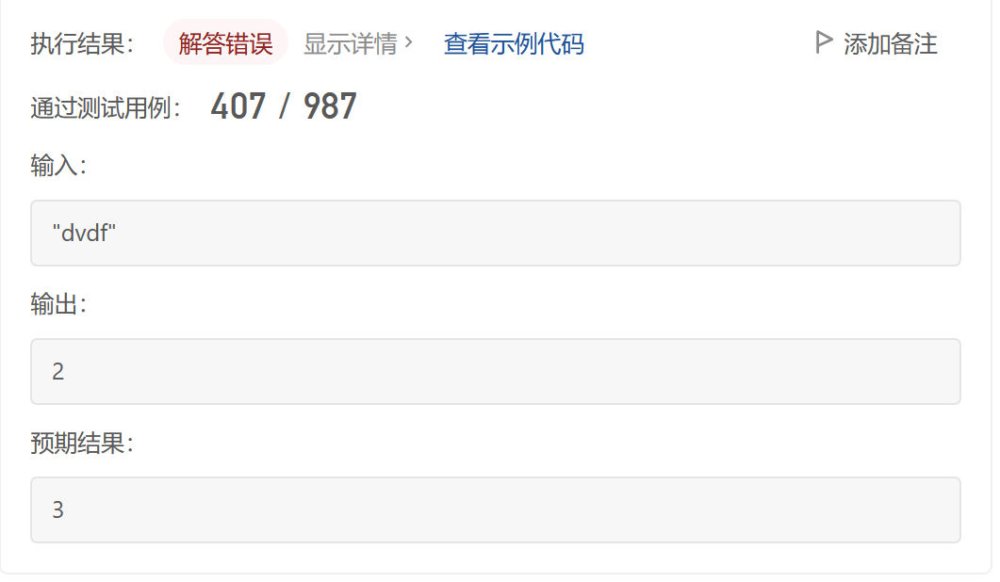

# [3. 无重复字符的最长子串](https://leetcode.cn/problems/longest-substring-without-repeating-characters/)

## 自己的题解

没通过，卡在示例                 

                       

```python
class Solution:
    def lengthOfLongestSubstring(self, s: str) -> int:
        maxnum=0
        tmp=0
        tmpstr=''
        for each in s:
            if each not in tmpstr:
                tmpstr+=each
                tmp+=1
            else:
                if tmp > maxnum: maxnum=tmp
                tmpstr=''+each
                tmp=1
        if tmp > maxnum: maxnum=tmp
        return maxnum

```

## 官方题解——滑动窗口

```python
class Solution:
    def lengthOfLongestSubstring(self, s: str) -> int:
        maxnum=0
        right=0
        v=set()
        for i in range(0,len(s)):
            if i >0:
                v.remove(s[i-1])
            while(right<len(s) and s[right] not in v):
                v.add(s[right])
                right+=1
            maxnum=max(maxnum,right-i)    
        return maxnum
```


