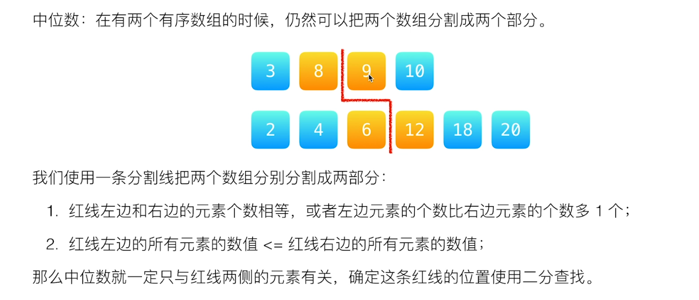
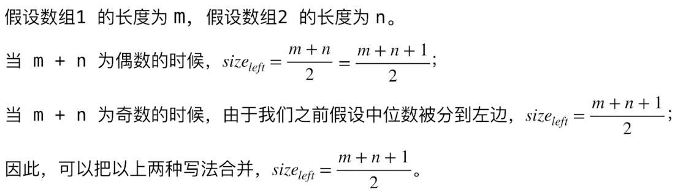
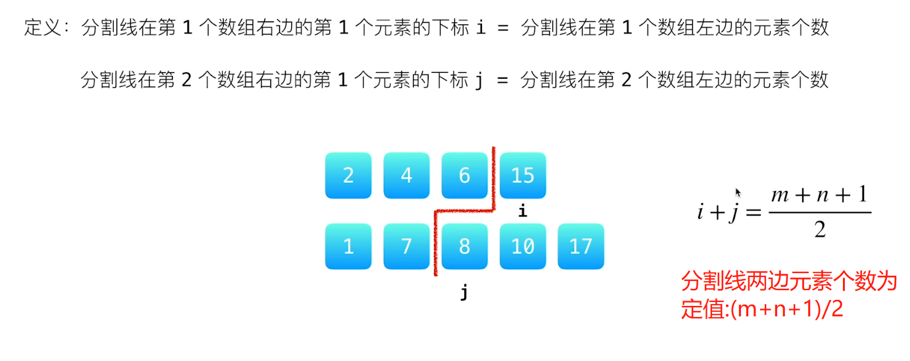
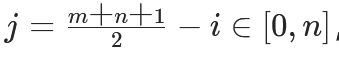
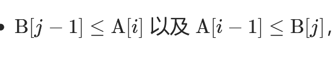

# 4.[（hard）寻找两个正序数组的中位数](https://leetcode.cn/problems/median-of-two-sorted-arrays/)

给定两个大小分别为 m 和 n 的正序（从小到大）数组 nums1 和 nums2。请你找出并返回这两个正序数组的 中位数 。

算法的时间复杂度应该为 O(log (m+n)) 。

## 二分查找法

中位数：把数组分割成两个部分。           

数组长度为偶数的时候，中位数有两个，分别是左边数组的最大值和右边数组的最小值；当数组长度为奇数，将中位数划分到左边。为左边数组的最大值                          

当有序数组有两个的时候，也可以进行分割                       


                   


需要满足以下两个条件

1. len(left_part)=len(right_part)或者len(left_part)=len(right_part)+1
2. max⁡(left_part)≤min⁡(right_part)max(left_part)≤min(right_part)


条件1：使用分割线，两边的数组的长度是固定的，是可以计算的；由于`/2`是整数除法，所以当`m+n`为偶数时，`(m+n)/2` 与`(m+n+1)/2`相等                      


                  


条件2：进行分割时，有序数组内一定是左边小于右边；所以只需要保证不同数组内，交叉小于等于关系成立


                     


分割线的定义

	1. `i`：第一个数组中，分割线右边第一元素的下标`i` = 分割线左边的元素个数
	1. `j`：第一个数组中，分割线右边第一元素的下标`j` = 分割线左边的元素个数


                       


规定第一个数组的长度小于第二个数组（如果不满足则交换），两个条件则可得到下面两个等式：

1. 长度固定，0≤i≤m,0≤j≤n，对任意的i属于[0,m]，都有                             

           

2. 交叉小于等于                


                      


因为i从[0,m]递增时，A[i-1]（分割线的左边）递增，B[j]（分割线的右边）递减（满足分割线两个元素个数平衡），所以一定存在一个最大的 i 满足 A[i−1]≤B[j]；如果 i 是最大的，那么说明 i+1 不满足。将 i+1带入可以得到 A[i]>B[j−1]，也就是 B[j−1]<A[i]。**相当于只需要满足：在[0.m]中找到最大的i，使得A[i−1]≤B[j]，且j=(m+n+1)/2 -i；**

```python
class Solution:
    def findMedianSortedArrays(self, nums1: List[int], nums2: List[int]) -> float:
        if len(nums1) > len(nums2):
            return self.findMedianSortedArrays(nums2, nums1)

        infinty = 2**40
        m, n = len(nums1), len(nums2)
        left, right = 0, m
        # median1：左边的最大值
        # median2：右边的最小值
        median1, median2 = 0, 0

        while left <= right:
            # 左边包含 nums1[0 .. i-1] 和 nums2[0 .. j-1]
            #右边包含 nums1[i .. m-1] 和 nums2[j .. n-1]
            i = (left + right) // 2 # 从中间开始查找
            j = (m + n + 1) // 2 - i

            # nums_im1, nums_i, nums_jm1, nums_j 分别表示 nums1[i-1], nums1[i], nums2[j-1], nums2[j]
            nums_im1 = (-infinty if i == 0 else nums1[i - 1])
            nums_i = (infinty if i == m else nums1[i])
            nums_jm1 = (-infinty if j == 0 else nums2[j - 1])
            nums_j = (infinty if j == n else nums2[j])

            if nums_im1 <= nums_j:
                median1, median2 = max(nums_im1, nums_jm1), min(nums_i, nums_j)
                left = i + 1
            else:
                right = i - 1

        return (median1 + median2) / 2 if (m + n) % 2 == 0 else median1
```

## 自己的题解

属于暴力破解，时间复杂度不够

```python
class Solution:
    def findMedianSortedArrays(self, nums1: List[int], nums2: List[int]) -> float:
        num=nums1+nums2
        num.sort()
        n=len(num)
        if n%2 ==0 : #偶数
            index=n//2
            return (num[index]+num[index-1])/2
        else:
            index=(n+1)//2
            return num[index-1]
```

