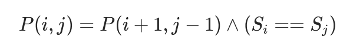
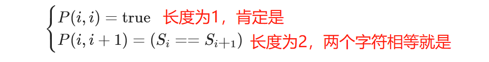

# [5. 最长回文子串(中等)](https://leetcode.cn/problems/longest-palindromic-substring/)

给你一个字符串 `s`，找到 `s` 中最长的回文子串。

如果字符串的反序与原始字符串相同，则该字符串称为回文字符串。

---

思路主要是卡在怎么缩小范围，当首位不一样的时候，是排除左边第一个还是排除右边第一个。排除左边第一个的话：abaa，就会错过aba

----

正确的思路：应该是由内到外扩展

## 方法一：动态规划

P(i,j)代表着s[i.j]是否为回文字符串，那么可以得到如下的动态规划            

            

也就是说，字符串s，s的首尾字母相同且除了首尾字符的字串也是回文串的情况下，字符串s才是回文串     

还有两个特别情况：长度为1和2 的情况             

               

最后答案就是所有P(i.j)=true的情况下，字串长度j-i+1最大的

