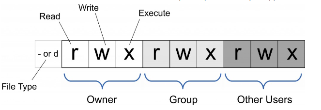
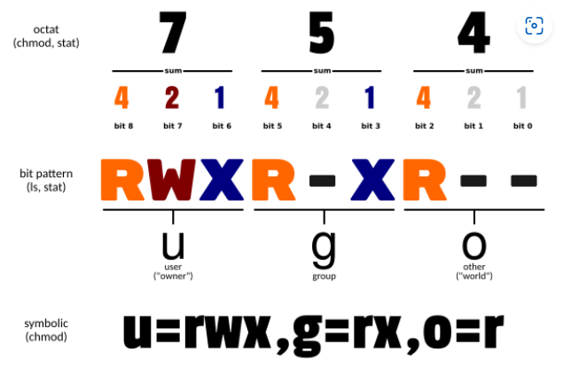

# 系统部署

## [Linux](https://www.runoob.com/linux/linux-command-manual.html)

### 查看进程ID

**ps命令**   

- a：显示一个终端的所有进程，除会话引线外；
- u：显示进程的归属用户及内存的使用情况；
- x：显示没有控制终端的进程；
- l：长格式显示更加详细的信息；
- e：显示所有进程               

- "ps aux" 可以查看系统中所有的进程；
- "ps -le" 可以查看系统中所有的进程，而且还能看到进程的父进程的 PID 和进程优先级
- "ps -l" 只能看到当前 Shell 产生的进程；      

- ps aux | grep "进程名字"：有两行显示，其中一行是grep产生的，如果只要一行输出的话：ps aux | grep "进程" | grep -v grep，-v就是反向查找的意思

- aux输出：

  | USER | PID    | %CPU    | %MEM     | VSZ                    | RSS              | TTY                    | STAT     | 进程状态 | TIME        | COMMAND          |
  | ---- | ------ | ------- | -------- | ---------------------- | ---------------- | ---------------------- | -------- | -------- | ----------- | ---------------- |
  | 用户 | 进程ID | 占用CPU | 占用内存 | 占用虚拟内存的大小(kb) | 占用实际物理内存 | 进程是在哪个终端运行的 | 进程状态 | 启动时间 | CPU占用时间 | 产生此进程的命令 |

  > CPU时间：CPU时间是指一段程序在CPU上面运行消耗的时间，也是内核时间（kernel time)。（因为进程运行状态分为运行、就绪和阻塞，只用运行时是调用CPU的）                       
  >
  > 系统时间(wall clock time, elapsed time)： 是指一段程序从运行到终止，系统时钟走过的时间。一般来说，系统时间都是要大于CPU时间的

### 查看进程占用端口

**ss命令**

- ss -tnlp
	- t：tcp；n：不解析服务名称；l：显示监听的端口 ；p：显示进程

**lsof**

-  lsof -i -P | grep ssh
-  lsof -i:22    22端口占用的进行

**netstat**

- netstat -tnlp

### 查看进程占用资源

**ps命令**

- ps -aux --sort -pcpu | less    根据 CPU 使用来升序排序
- ps -aux --sort -pcpu,+pmem | head -n 10 #查询全10个使用cpu和内存最高的应用
- linux下获取占用CPU资源最多的10个进程：ps aux|head -1;ps aux|sort -rn -k +3|head -n 10
	- ps aux|head -1：主要是为了获取标题（USER PID %CPU %MEM VSZ RSS TTY STAT START TIME COMMAND）
	- ps aux|sort -rn -k +3|head -n 10
		- sort -rn -k +3：该命令中的-rn的r表示是结果倒序排列，n为以数值大小排序，而-k +3则是针对第3列的内容进行排序，第三列是 cpu，第四列是内存，再使用head -n命令获取默认前10行数据。(其中的|表示管道操作)

**top**：按照CPU排序

> 为什么CPU显示会超过100%：   
> 1. 多个 CPU 核心或超线程技术      
> 2. 有些操作系统和工具可能会将系统中其他资源的使用率也计算在 CPU 使用率中，例如内存、硬盘、网络等

### 文件/目录大小
- 查看文件大小
  - `ls  -lht`：查看文件大小，h代表人类可读，t会显示文件大小总和
  - `du -sh *`
- 查看系统存储剩余空间
	- `df -h`

### 统计
- 统计当前目录下文件的个数（不包括目录）

	- ls -l | grep "^-" | wc -l
- 统计当前目录下文件的个数（包括子目录）

	- ls -lR| grep "^-" | wc -l

- 查看某目录下文件夹(目录)的个数（包括子目录）

	- ls -lR | grep "^d" | wc -l

- 统计当前文件夹下叫某某的文件的数量

	- find . -name filename | wc -l

- 统计当前文件夹下指定类型的文件的数量

	- 例如这里需要找 js 文件的数量：find -name "*.js" | wc -l

- 统计文件行数
	- wc -l

### sed流编辑器
- 字符串替换
	- sed's/旧字符串/新字符串/g' 文件名

### 修改文件权限

Linux/Unix 的文件调用权限分为三级 : 文件所有者（Owner）、用户组（Group，文件所有者在的组）、其它用户（Other Users）            
              

file type：d表示目录             

          

chmod参数

- u 表示该文件的拥有者，g 表示与该文件的拥有者属于同一个群体(group)者，o 表示其他以外的人，a 表示这三者皆是。
- + 表示增加权限、- 表示取消权限、= 表示唯一设定权限。
- r 表示可读取，w 表示可写入，x 表示可执行，X 表示只有当该文件是个子目录或者该文件已经被设定过为可执行。

示例：

- 将文件 file1.txt 与 file2.txt 设为该文件拥有者，与其所属同一个群体者可写入，但其他以外的人则不可写入 :
	- chmod ug+w,o-w file1.txt file2.txt
- file权限全部提到最高 :
	- chmod 777 file
	- chmod a=rwx file

## Docker
1. 什么是Docker？
	- Docker是一种开源的容器化平台，用于将应用程序及其依赖项打包在一个可移植的容器中，具有隔离、快速、轻便的特点。

2. Docker与虚拟机有何不同？
	- 架构和隔离性：虚拟机是创建一个完整得操作系统，具有自己的内核、应用程序和系统资源。而docker是创建容器来隔离应用程序和其依赖项
	- 资源消耗：虚拟机消耗更多
	- 可移植性和部署速度：docker更快

3. Docker镜像是什么？
	- Docker镜像是一个可执行的软件包，它包含了运行一个特定应用程序所需的所有内容，如代码、依赖项、运行时、库文件、配置等。
	- 可以通过DockerFile构建或通过容器Commit生成。

4. Docker容器是什么？
	- 镜像实例

5. Docker容器有几种状态？
	- 四种状态：运行，暂停，重启，退出

6. DockerFile常见指令
	- FROM
	- ADD COPY
	- ENV WORKDIR
	- RUN
	- CMD ENTRYPOINT

7. Dockerfile中的命令COPY和ADD命令有什么区别？
	- COPY是复制文件
	- ADD可以自动解压

8. Docker常用命令
	- docker run,docker ps,docker stop/rm/images/pull/push/build/exec

9. 容器与主机之间的数据拷贝命令
	- 主机到容器：docker cp <主机路径> <容器ID>:<容器路径> 
	- 容器到主机：docker cp <容器ID>:<容器路径> <主机路径>

10. 启动nginx容器（随机端口映射），并挂载数据卷
	- docker run -d --name myNginx -P -v <主机路径>:<容器路径> nginx

11. 什么是Docker Swarm？
	- 与Docker引擎集成的集群管理

12. 如何批量清理临时镜像文件？
	- docker rmi -f $(docker images -q)

13. 如何查看镜像支持的环境变量？
	- docker run <镜像ID> env

14. 本地的镜像文件都存放在哪里?
	- 镜像文件路径：/var/lib/docker/image
	- 容器文件路径：/var/lib/docker/containers

15. 构建Docker镜像应该遵循哪些原则?
1).尽量选取满足需求但较小的基础系统镜像
2).清理编译生成文件、安装包的缓存等临时文件
3).安装各个软件时候要指定准确的版本号，并避免引入不需要的依赖
4).从安全的角度考虑，应用尽量使用系统的库和依赖
5).使用Dockerfile创建镜像时候要添加.dockerignore文件或使用干净的工作目录

16. 容器退出后，通过docker ps 命令查看不到，数据会丢失么？
	- docker ps -a
	- `--rm`：会在退出时直接删除

17. 如何停止所有正在运行的容器?
	- docker stop $(docker ps -q)

18. 如何退出容器不终止容器
	- Ctrl+P+Q

19. 如何清理批量后台停止的容器
	- docker rm $(docker ps -aq)

20. 如何查看容器日志？
	- docker logs <容器ID>

21. 可以在一个容器中同时运行多个应用进程吗？
	- 可以

22. docker迁移
	- Docker镜像迁移：将镜像推送到Docker Hub或私有镜像仓库中，然后在目标主机或云平台上拉取镜像，再创建容器即可。
	- 导出和导入容器：可以使用docker export命令将容器导出到一个tar文件中，然后将该文件拷贝到目标主机或云平台上，并使用docker import命令将容器导入到目标主机或云平台上。